# 🌐 ISPManagementSystem

A simple **Java-based Internet Service Provider (ISP) management application**. Provides an admin interface for managing customers, plans, billing, and basic ISP operations.

## 🔑 Key Information

* 💻 **Language:** Java
* 🛠️ **Recommended IDE:** Apache NetBeans
* 🗄️ **Database:** MySQL
* 🔐 **Default Admin Credentials:**

  * **Username:** `admin`
  * **Password:** `admin`

## 📖 Overview

**ISPManagementSystem** is a Java application intended to manage common ISP tasks such as creating and managing customer accounts, assigning plans, and tracking billing records.

This repository contains the source code for the application and expects a **MySQL database** for persistent storage.

## ✨ Features

* 🔐 Admin login and user management
* 📦 Plan and package management
* 👥 Customer account creation and management
* 💰 Billing and invoice tracking
* 📊 Basic reporting and search functionality


## 📸 Screenshots

### 🏠 Home Page

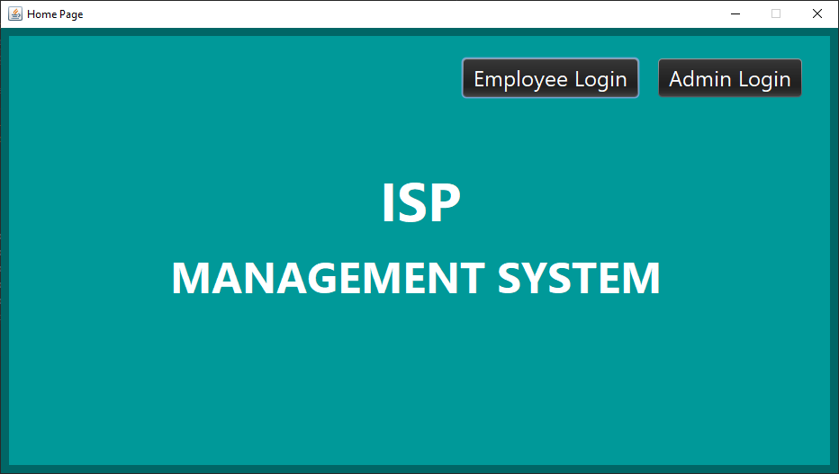

### 🔐 Admin Login

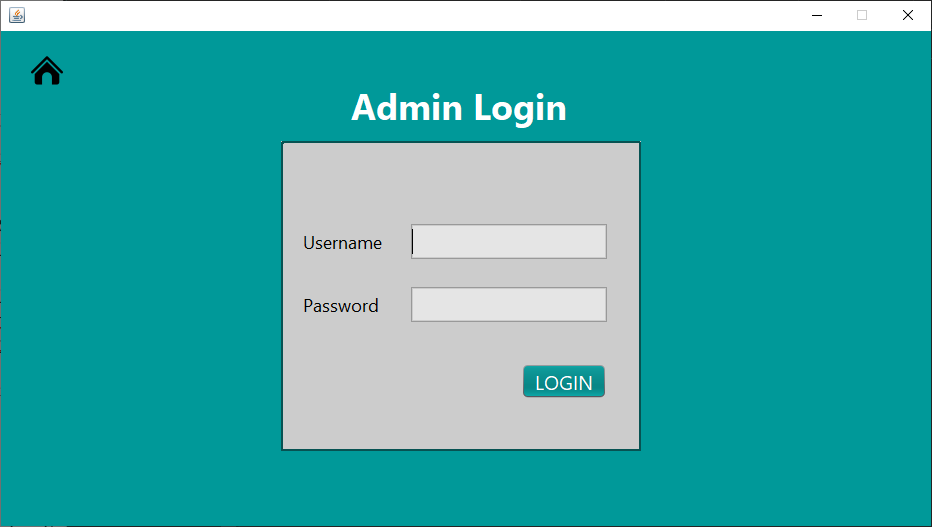

### 🛡️ Admin Dashboard

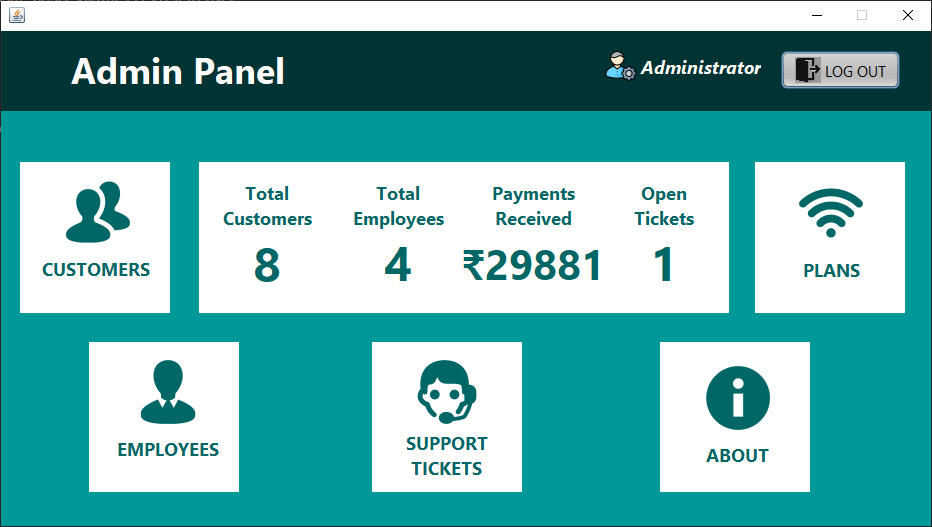

### 👨‍💼 Employee Login

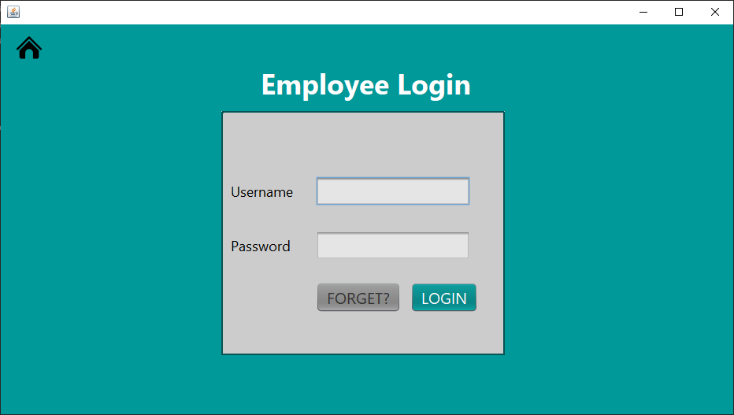

### 💼 Employee Dashboard

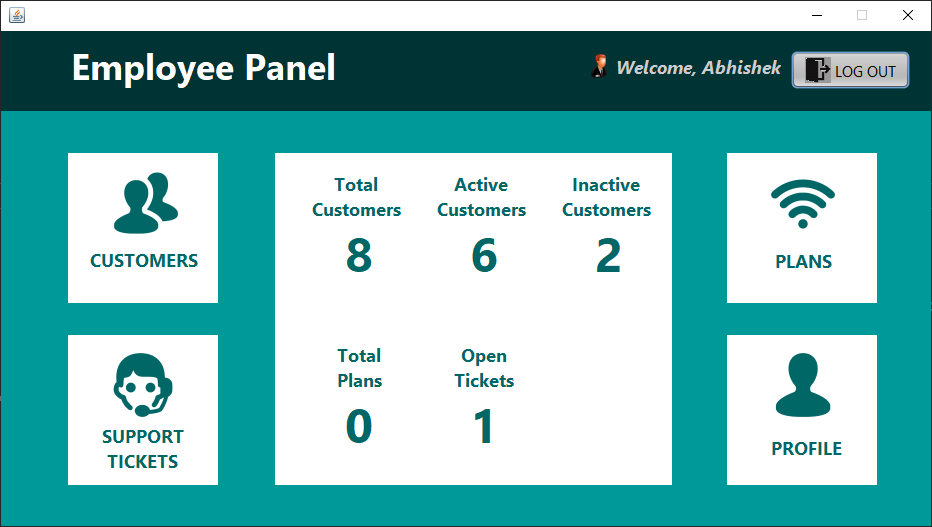
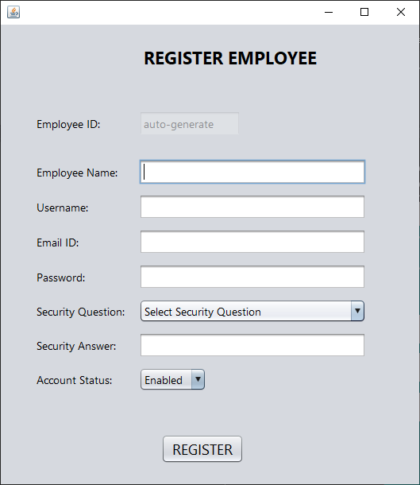

### 👥 Customer Management

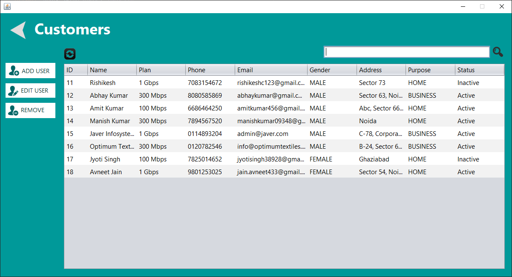
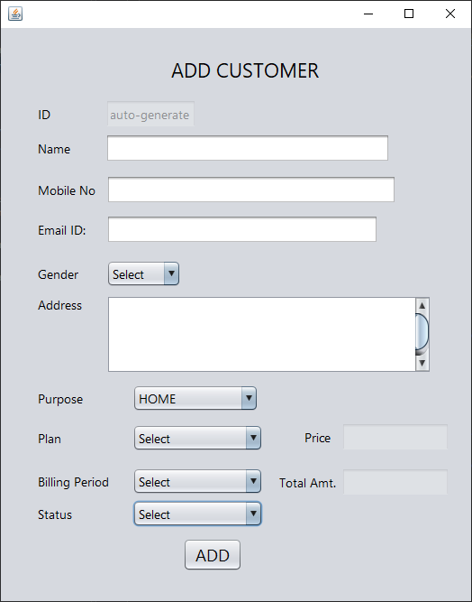

### 📦 Plan Management

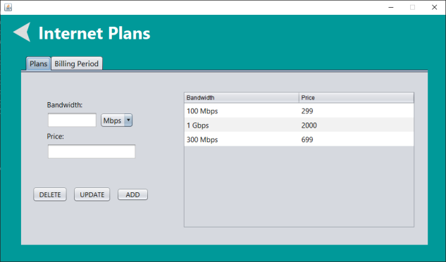

### 👥 Employees Management

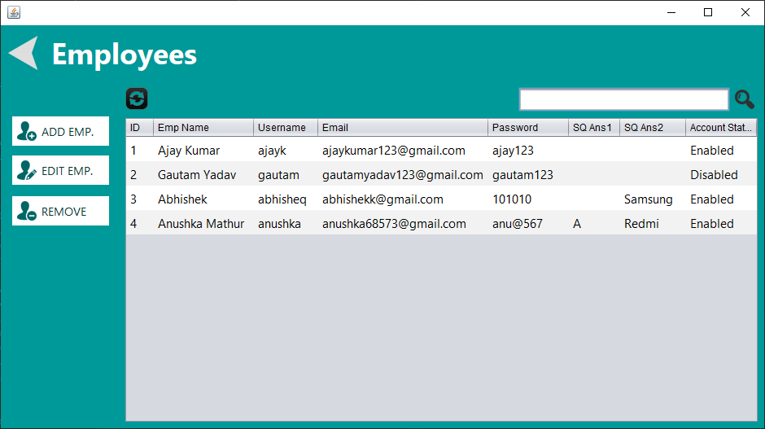

### ❓ Support Tickets

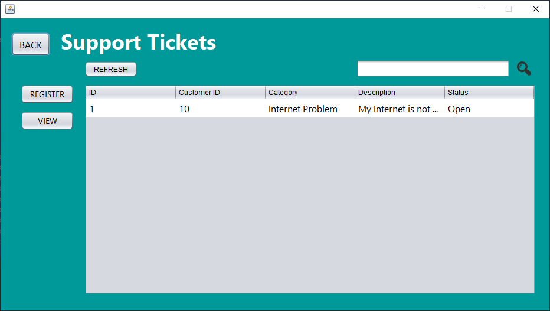


## 📋 Prerequisites

Before running the application, make sure you have:

* ☕ Java 8+ (JDK)
* 🗄️ MySQL Server
* 🛠️ Apache NetBeans (recommended) or another Java IDE
* 📦 (Optional) Maven or Gradle if provided by the project

## 🚀 Quickstart (IDE)

### 1️⃣ Clone the Repository

```bash
git clone https://github.com/MrAbhisheq/ISPManagementSystem.git
```

### 2️⃣ Open the Project

Open the cloned project in **Apache NetBeans**.

### 3️⃣ Configure Database Connection

* 🗄️ Create a MySQL database for the application (e.g., `isp_db`).
* ⚙️ Update the application's database connection settings.
* 🔍 Search for files or constants named like:

  * `db`
  * `database`
  * `config`
  * `application.properties`

### 4️⃣ ▶️ Run the Application

Run the project directly from the IDE.

### 5️⃣ 🔑 Login

Use the default admin credentials:

```text
Username: admin
Password: admin
```

> ⚠️ Change the default password after the first login.

## 💻 Quickstart (Command Line / Build Tool)

If the project includes a build tool, use the appropriate commands.

### 🐘 Maven

```bash
mvn clean package
java -jar target/<artifact>.jar
```

### 🐘 Gradle

```bash
./gradlew build
java -jar build/libs/<artifact>.jar
```

> ℹ️ Adjust the commands according to the actual build artifacts present in the repository.

## 🗄️ Database Setup

1. 🐬 Install and start **MySQL Server**.
2. 🗃️ Create a database and user with appropriate privileges.
3. 📄 If SQL schema or seed files are included in the repository, look for:

   * `sql/`
   * `db/`
4. ▶️ Run the required SQL scripts to create tables and initial data.
5. 🔗 Ensure the application's database configuration points to the correct MySQL database.

## ⚙️ Configuration

Locate the configuration file used for database credentials and application settings.

Update environment-specific values such as:

* 🔗 Database URL
* 👤 Database username
* 🔑 Database password
* 🌐 Ports and other application settings

> 🔒 **Security Tip:** Consider using environment variables or a properties file to avoid committing sensitive credentials to the repository.

## 🧪 Testing

If unit tests are available, run them using the appropriate build tool:

### Maven

```bash
mvn test
```

### Gradle

```bash
./gradlew test
```

### 🖱️ Manual Testing

Exercise the admin flows in the application UI and verify that database records are created and updated as expected.

## 🛠️ Troubleshooting

### 🗄️ Database Connection Errors

Verify that:

* MySQL is running.
* 🔗 The database connection URL is correct.
* 👤 Database username and password are correct.
* 📋 Required database tables and schema exist.

### ⚙️ Build / Run Issues

* ☕ Check Java version compatibility.
* 📦 Ensure all required libraries and dependencies are available.
* 🛠️ Verify the project is correctly configured in your IDE.

## 🤝 Contributing

Contributions are welcome!

1. 🍴 Fork the repository.
2. 🌿 Create a feature branch:

```bash
git checkout -b feature/your-change
```

3. 💻 Make your changes and include tests where appropriate.
4. 📤 Open a Pull Request describing your changes.

## 📄 License

No license is currently specified in the repository.

If you want this project to be open-source, consider adding a `LICENSE` file, such as:

* MIT
* Apache-2.0

## 📬 Contact

👤 **Repository Owner:** `@MrAbhisheq`

For questions or help setting up the project, open an issue in the repository.
